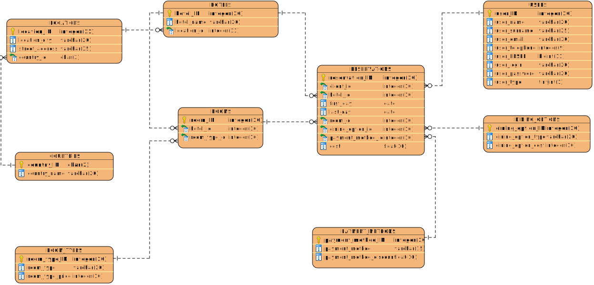

# Hotel
Celem projektu było zaprojektowanie i implementacja bazy danych dla losowo przydzielonego tematu.


| Nazwisko i imię  | Wydział | Kierunek | Semestr | Grupa | Rok akademicki |
| :-------------:  | :-----: | :------: | :-----: | :---: | :------------: |
| Szczupak Ewelina | WIMiIP  | IS       |   4     | 4     | 2019/2020      |
| Witkowski Mateusz| WIMiIP  | IS       |   4     | 4     | 2019/2020      |

## Projekt bazy danych hotelu
Projekt ten umożliwia przede wszytskim rejestrację nowych klientów hotelu oraz dokonywanie rezerwacji. Klient hotelu może wybrać m.in. odpowiedni dla siebie hotel, rodzaj pokoju, dining options oraz metodę płatności, od której zależy rabat na całkowity koszt pobytu. Dzięki polu **user_type** w tabeli **USERS** aplikacja rozróżnia podczas logowania klientów od administratorów, którzy mają dostęp do dodatkowych opcji, takich jak np. możliwość dodawania lub usuwania pokoi czy modyfikacja cen.



Do generowania bazy danych użyto panelu kontrolnego **XAMPP** oraz **phpMyAdmin**. Stworzono 9 encji, wykorzystując m.in. zapytania **DML**, dzięki którym możliwe jest dokonywanie operacji, takich jak umieszczanie w bazie, kasowanie i przeglądanie oraz zapytań **DDL**, które umożliwiają zmienianie i kasowanie tabel. W każdej tabeli dodano klucz główny, który umożliwa identyfikację każdego rekordu.

Przykładowe zapytania tworzące tabele:

Kluczem prywatnym w tabeli HOTELS jest klucz _hotel_ID_.

```sql
CREATE TABLE `hotels` (
  `hotel_ID` int(10) NOT NULL,
  `hotel_name` varchar(20) NOT NULL,
  `location_id` int(11) NOT NULL
) ENGINE=InnoDB DEFAULT CHARSET=utf8mb4;
```
Kluczem identyfikującym tabelę RESERVATIONS jest klucz prywatny _reservation_ID_.  W celu stworzenia powiązania obu tabel, w tabeli RESERVATIONS wygenerowano klucz obcy: _hotel_id.

```sql
CREATE TABLE `reservations` (
  `reservation_ID` int(10) NOT NULL,
  `client_id` int(10) NOT NULL,
  `hotel_id` int(10) NOT NULL,
  `first_day` date NOT NULL,
  `last_day` date NOT NULL,
  `room_id` int(10) NOT NULL,
  `dining_option_id` int(20) NOT NULL,
  `payment_method_id` int(10) NOT NULL,
  `cost` float DEFAULT NULL
) ENGINE=InnoDB DEFAULT CHARSET=utf8mb4;
```
Przykładowe polecenia tworzące relacje między tabelemi:

```sql
ALTER TABLE `hotels`
  ADD PRIMARY KEY (`hotel_ID`),
  ADD UNIQUE KEY `hotel_name` (`hotel_name`),
  ADD KEY `hotels_locations_fk` (`location_id`);
  ```
  
  ```sql
ALTER TABLE `reservations`
  ADD PRIMARY KEY (`reservation_ID`),
  ADD KEY `reservation_clients_fk` (`client_id`),
  ADD KEY `reservation_hotel_fk` (`hotel_id`),
  ADD KEY `reservation_dining_options_fk` (`dining_option_id`),
  ADD KEY `reservation_rooms_fk` (`room_id`),
  ADD KEY `reservations_payment_methods_fk` (`payment_method_id`);
  ```
  
Po prawidłowym utworzeniu wszystkich tabel oraz połączeń między nimi przystąpiono do wypełniania tabel odpowiednimi rekordami. Wykorzystano do tego zapytań DML. W celu uniknięcia błędów, wprowadzanie danych rozpoczęto od tabeli, która ma najmniej powiązań z innymi tabelami, czyli np. od tabeli COUNTRIES. 
Przykładowe zapytania wypełniające tabele:

```sql
INSERT INTO `countries` (`country_ID`, `country_name`) VALUES
('DE', 'Germany'),
('ES', 'Spain'),
('GR', 'Greece'),
('PL', 'Poland');
```
```sql
INSERT INTO `hotels` (`hotel_ID`, `hotel_name`, `location_id`) VALUES
(1, 'E&M', 1),
(2, 'Hilton', 2),
(3, 'EwelMat', 3),
(4, 'Sheraton', 4),
(5, 'Mamaison Le Regina', 5),
(6, 'Descansa con nosotro', 6);
```


## Implementacja zapytań SQL
Tutaj należy wylistować wszystkie funkcjonalności, wraz z odpowiednimi zapytaniami SQL. W tej sekcji należy zawrzeć wyłącznie zapytania z grupy DML oraz DQL.

## Aplikacja
Tutaj należy opisać aplikację, która wykorzystuje zapytania SQL z poprzedniego kroku. Można, jednak nie jest to konieczne, wrzucić tutaj istotne snippety z Waszych aplikacji.

## Dodatkowe uwagi
W tej sekcji możecie zawrzeć informacje, których nie jesteście w stanie przypisać do pozostałych. Mogą to być również jakieś komentarze, wolne uwagi, itp.
